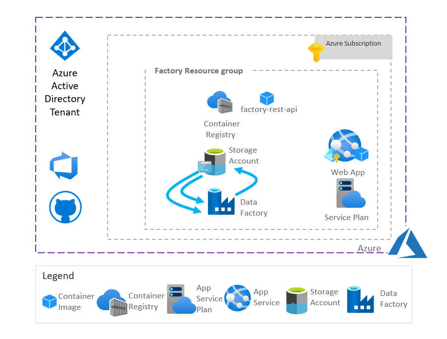
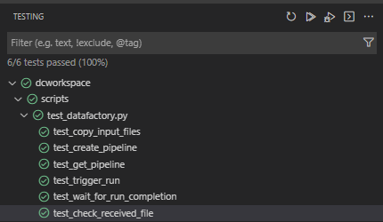

# How to automate the creation of data factory pipelines?
# Table of Contents
- [How to automate the creation of data factory pipelines?](#how-to-automate-the-creation-of-data-factory-pipelines)
- [Table of Contents](#table-of-contents)
  - [Introduction](#introduction)
  - [Installing the pre-requisites](#installing-the-pre-requisites)
    - [Installing Git](#installing-git)
    - [Installing Docker and Visual Studio Code](#installing-docker-and-visual-studio-code)
  - [Installing the project](#installing-the-project)
    - [Clone the repository](#clone-the-repository)
    - [Launch Visual Studio Code with the dev container](#launch-visual-studio-code-with-the-dev-container)
  - [Architecture](#architecture)
  - [Deploying Data Factory Service](#deploying-data-factory-service)
  - [Build and deploy container images](#build-and-deploy-container-images)
  - [Factory REST API reference](#factory-rest-api-reference)
    - [**Get Version**](#get-version)
      - [Url parameters](#url-parameters)
      - [Request Headers](#request-headers)
      - [Request Body](#request-body)
      - [Responses](#responses)
    - [**Get Time**](#get-time)
      - [Url parameters](#url-parameters-1)
      - [Request Headers](#request-headers-1)
      - [Request Body](#request-body-1)
      - [Responses](#responses-1)
    - [**Create pipeline**](#create-pipeline)
      - [Url parameters](#url-parameters-2)
      - [Request Headers](#request-headers-2)
      - [Request Body](#request-body-2)
      - [PipelineRequest](#pipelinerequest)
      - [Dataset](#dataset)
      - [Responses](#responses-2)
      - [PipelineResponse](#pipelineresponse)
      - [Error](#error)
    - [**Get pipeline**](#get-pipeline)
      - [Url parameters](#url-parameters-3)
      - [Request Headers](#request-headers-3)
      - [Request Body](#request-body-3)
      - [Responses](#responses-3)
    - [**Run pipeline job**](#run-pipeline-job)
      - [Url parameters](#url-parameters-4)
      - [Request Headers](#request-headers-4)
      - [Request Body](#request-body-4)
      - [Responses](#responses-4)
      - [RunResponse](#runresponse)
      - [Status](#status)
    - [**Get pipeline job status**](#get-pipeline-job-status)
      - [Url parameters](#url-parameters-5)
      - [Request Headers](#request-headers-5)
      - [Request Body](#request-body-5)
      - [Responses](#responses-5)
  - [Factory service source code](#factory-service-source-code)
    - [Data Models](#data-models)
    - [Application Settings](#application-settings)
    - [REST API](#rest-api)
    - [Services](#services)
  - [Unit tests](#unit-tests)
    - [Running unit tests with bash file launch-unit-tests.sh](#running-unit-tests-with-bash-file-launch-unit-testssh)
    - [Running unit tests with Visual Studio Code](#running-unit-tests-with-visual-studio-code)
  - [End-to-end tests](#end-to-end-tests)
    - [Calling the rest api from the Web browser](#calling-the-rest-api-from-the-web-browser)
    - [bash file integration-test.sh](#bash-file-integration-testsh)
    - [Pytest with test_datafactory.py file](#pytest-with-test_datafactorypy-file)
  - [Next steps](#next-steps)

## Introduction

This repository contains a sample service creating workflow pipelines to prepare delimited text datasets. This data preparation consists in different filters:

- a first filter used to select specific rows in the source dataset using a join dataset
- a second filter used to select specific columns in the source dataset

The result dataset is stored in a sink dataset.
The source, join and sink datasets are delimited text files (CSV files)


The main objectives of this sample implementation of a REST API using Azure Data Factory are:

- preparing securely data using isolated storage account
- preparing easily data with a simple REST API (Pipeline creation - POST /pipeline and Pipeline run - POST /pipeline/{pipeline_name}/run)
- offer a flexible implementation based on containers to support either Azure App Service, Azure Function, Azure Container Instance or Azure Kubernetes Architectures.

The solution is based on an infrastructure supporting Azure Data Factory, Azure Storage Account, Azure App Service hosting the REST API and an Azure Container Registry storing the container images.



This solution is based on a REST API:

- factory REST API


This API can be hosted in containers running in Azure App Services, Azure Functions, Azure Container Instances, Azure Kubernetes Services.

## Installing the pre-requisites

In order to deploy and test this solution we recommend to use Docker, Visual Studio Code with a dev container.
This chapter describes how to install Git, Docker, Terraform and Visual Studio Code on Windows, MacOS and Linux.

### Installing Git

Git client will be required to clone the repository on your local machine. Git client can installed on Windows, MacOS, Linux.

[Installing Git on several platform](https://git-scm.com/book/en/v2/Getting-Started-Installing-Git)

### Installing Docker and Visual Studio Code

|[](https://www.docker.com/products/docker-desktop)|[](https://docs.docker.com/get-docker/)|[](https://www.docker.com/products/docker-desktop)|
| :--- | :--- | :--- |
| [Docker Desktop](https://www.docker.com/products/docker-desktop) 2.0+ on Windows 10 Pro/Enterprise. Windows 10 Home (2004+) requires Docker Desktop 2.3+ and the [WSL 2 back-end](https://docs.docker.com/desktop/windows/wsl/). (Docker Toolbox is not supported. Windows container images are not supported.) <br />[Visual Studio Code](https://code.visualstudio.com/docs/setup/windows)|  [Docker CE/EE](https://docs.docker.com/get-docker/) 18.06+ and [Docker Compose](https://docs.docker.com/compose/install/) 1.21+. (The Ubuntu snap package is not supported.) <br />[Visual Studio Code](https://code.visualstudio.com/docs/setup/linux) &nbsp;&nbsp; &nbsp;&nbsp; &nbsp;&nbsp; &nbsp;&nbsp; &nbsp;&nbsp; &nbsp;&nbsp; &nbsp;&nbsp; &nbsp;&nbsp; &nbsp;&nbsp; &nbsp;&nbsp; &nbsp;&nbsp; &nbsp;&nbsp; &nbsp;&nbsp; &nbsp;&nbsp; &nbsp;&nbsp; &nbsp;&nbsp; &nbsp;&nbsp; &nbsp;&nbsp; &nbsp;&nbsp; &nbsp;&nbsp; &nbsp;&nbsp; &nbsp;&nbsp; &nbsp; &nbsp;&nbsp; &nbsp;&nbsp; &nbsp;&nbsp; &nbsp;&nbsp; &nbsp;&nbsp; &nbsp;&nbsp; &nbsp;&nbsp; &nbsp;&nbsp; &nbsp;&nbsp; &nbsp;&nbsp; &nbsp;&nbsp; &nbsp;&nbsp; &nbsp;&nbsp; &nbsp;&nbsp; &nbsp;&nbsp; &nbsp;&nbsp; &nbsp;&nbsp; &nbsp;&nbsp; &nbsp;&nbsp; &nbsp;&nbsp; &nbsp;&nbsp; &nbsp;&nbsp; &nbsp;&nbsp; &nbsp;&nbsp; &nbsp;&nbsp; &nbsp;&nbsp; &nbsp;&nbsp; &nbsp;&nbsp; &nbsp;&nbsp; &nbsp;&nbsp; &nbsp;&nbsp; &nbsp;&nbsp; &nbsp;&nbsp; &nbsp;&nbsp; &nbsp;&nbsp; &nbsp;&nbsp; &nbsp;&nbsp; &nbsp; &nbsp;&nbsp; &nbsp;&nbsp; &nbsp;&nbsp; &nbsp;&nbsp; &nbsp;&nbsp; &nbsp;&nbsp; &nbsp;&nbsp; &nbsp;&nbsp; &nbsp;&nbsp; &nbsp;&nbsp; &nbsp;&nbsp; &nbsp;&nbsp; &nbsp;&nbsp; &nbsp;&nbsp; &nbsp;&nbsp; &nbsp;&nbsp; &nbsp;&nbsp; &nbsp;&nbsp; &nbsp;&nbsp; &nbsp;&nbsp; &nbsp;&nbsp; &nbsp;&nbsp; &nbsp;&nbsp; &nbsp;&nbsp; &nbsp;&nbsp; &nbsp;&nbsp; &nbsp;&nbsp; &nbsp;&nbsp; &nbsp;&nbsp; &nbsp;&nbsp; &nbsp;&nbsp; &nbsp;&nbsp; &nbsp;&nbsp; &nbsp;&nbsp; &nbsp;&nbsp; &nbsp;&nbsp; &nbsp;&nbsp; &nbsp; &nbsp;&nbsp; &nbsp;&nbsp; &nbsp;&nbsp; &nbsp;&nbsp; &nbsp;&nbsp; &nbsp;&nbsp; &nbsp;&nbsp; &nbsp;&nbsp; &nbsp;&nbsp; &nbsp;&nbsp; &nbsp;&nbsp; &nbsp;&nbsp; &nbsp;&nbsp; &nbsp;&nbsp; &nbsp;&nbsp; &nbsp;&nbsp; &nbsp;&nbsp; &nbsp;&nbsp; &nbsp;&nbsp; &nbsp;&nbsp; &nbsp;&nbsp; &nbsp;&nbsp; &nbsp;&nbsp;    | [Docker Desktop](https://www.docker.com/products/docker-desktop) 2.0+. <br />[Visual Studio Code](https://code.visualstudio.com/docs/setup/mac) &nbsp;&nbsp; &nbsp;&nbsp; &nbsp;&nbsp; &nbsp;&nbsp; &nbsp;&nbsp; &nbsp;&nbsp; &nbsp;&nbsp; &nbsp;&nbsp; &nbsp;&nbsp; &nbsp;&nbsp; &nbsp;&nbsp; &nbsp;&nbsp; &nbsp;&nbsp; &nbsp;&nbsp; &nbsp;&nbsp; &nbsp;&nbsp; &nbsp;&nbsp; &nbsp;&nbsp; &nbsp;&nbsp; &nbsp;&nbsp; &nbsp;&nbsp; &nbsp;&nbsp; &nbsp; &nbsp;&nbsp; &nbsp;&nbsp; &nbsp;&nbsp; &nbsp;&nbsp; &nbsp;&nbsp; &nbsp;&nbsp; &nbsp;&nbsp; &nbsp;&nbsp; &nbsp;&nbsp; &nbsp;&nbsp; &nbsp;&nbsp; &nbsp;&nbsp; &nbsp;&nbsp; &nbsp;&nbsp; &nbsp;&nbsp; &nbsp;&nbsp; &nbsp;&nbsp; &nbsp;&nbsp; &nbsp;&nbsp; &nbsp;&nbsp; &nbsp;&nbsp; &nbsp;&nbsp; &nbsp;&nbsp; &nbsp;&nbsp; &nbsp;&nbsp; &nbsp;&nbsp; &nbsp;&nbsp; &nbsp;&nbsp; &nbsp;&nbsp; &nbsp;&nbsp; &nbsp;&nbsp; &nbsp;&nbsp; &nbsp;&nbsp; &nbsp;&nbsp; &nbsp;&nbsp; &nbsp;&nbsp; &nbsp;&nbsp; &nbsp; &nbsp;&nbsp; &nbsp;&nbsp; &nbsp;&nbsp; &nbsp;&nbsp; &nbsp;&nbsp; &nbsp;&nbsp; &nbsp;&nbsp; &nbsp;&nbsp; &nbsp;&nbsp; &nbsp;&nbsp; &nbsp;&nbsp; &nbsp;&nbsp; &nbsp;&nbsp; &nbsp;&nbsp; &nbsp;&nbsp; &nbsp;&nbsp; &nbsp;&nbsp; &nbsp;&nbsp; &nbsp;&nbsp; &nbsp;&nbsp; &nbsp;&nbsp; &nbsp;&nbsp; &nbsp;&nbsp; &nbsp;&nbsp; &nbsp;&nbsp; &nbsp;&nbsp; &nbsp;&nbsp; &nbsp;&nbsp; &nbsp;&nbsp; &nbsp;&nbsp; &nbsp;&nbsp; &nbsp;&nbsp; &nbsp;&nbsp; &nbsp;&nbsp; &nbsp;&nbsp; &nbsp;&nbsp; &nbsp;&nbsp; &nbsp; &nbsp;&nbsp; &nbsp;&nbsp; &nbsp;&nbsp; &nbsp;&nbsp; &nbsp;&nbsp; &nbsp;&nbsp; &nbsp;&nbsp; &nbsp;&nbsp; &nbsp;&nbsp; &nbsp;&nbsp; &nbsp;&nbsp; &nbsp;&nbsp; &nbsp;&nbsp; &nbsp;&nbsp; &nbsp;&nbsp;  |

## Installing the project

### Clone the repository

For you local machine running Windows or MacOS or Linux, open a Terminal and run the following command. 

1. Create a directory to copy the repository

      mkdir myproject

      cd myproject

2. Clone the repository

      git clone https://CSECodeHub@dev.azure.com/CSECodeHub/409271%20-%20Bertelsmann%20-%20Global%20Data%20Platform/_git/sharing-data-rest-api

### Launch Visual Studio Code with the dev container

1. In the same terminal, navigate to the project folder

      cd sharing-data-rest-api

2. Launch Visual Studio Code from your terminal with the following command:

      code .

3. A first dialog box will appear asking the question "Do you trust the authors of the files in this folder?", click on the Yes button.

    

4. A second dialog box will appear asking whether you want to open the project with a dev container. Click on the button "reopen in container"

    

5. Visual Studio Code will build the dev container. After few minutes, the dev container has been built, you you can open a shell running on this dev container

    

6. Select the sub menu "New Terminal" in the menu "Terminal".

    

7. Select the sub menu "New Terminal" in the menu "Terminal". The Terminal appears, and you can use linux shell commands like "ls -l"

    

8. You are now ready to run:
   - locally the REST APIs,
   - in a local docker container the REST APIs,
   - in docker containers in Azure App Services the REST APIs  
  The Dev Container is configured to support the following tools:
   - Azure CLI
   - Docker CLI
   - docker-compose
   - python/pip
   - Terraform

## Architecture

The solution is based on a set of sharing nodes deployed in different organizations in different Azure Subscriptions.
Each sharing node is defined with :

- Azure Storage Account where the datasets are stored
- Azure Data Factory used to prepare data 
- Azure Container Registry used to store the container images of the factory rest API
- Azure App Service hosting the factory rest API

Below the architecture based on Azure App Service hosting the rest APIs


The schema below describe the differents REST APIs used.


## Deploying Data Factory Service

The infrastructure associated with the Azure Data Factory is deployed using ARM templates.

Template for the factory service: **scripts/arm-factory-template.json**:

```json
{
  "$schema": "https://schema.management.azure.com/schemas/2019-04-01/deploymentTemplate.json#",
  "contentVersion": "1.0.0.0",
  "parameters": {
    "name": {
      "type": "string",
      "defaultValue": "[concat('webapp', uniqueString(resourceGroup().id))]",
      "minLength": 2,
      "metadata": {
        "description": "Web app name."
      }
    },
    "location": {
      "type": "string",
      "defaultValue": "[resourceGroup().location]",
      "metadata": {
        "description": "Location for all resources."
      }
    },
    "sku": {
      "type": "string",
      "defaultValue": "B1",
      "metadata": {
        "description": "The SKU of App Service Plan."
      }
    }
  },
  "variables": {
    "webAppName": "[concat('webapp', parameters('name'))]",
    "appServicePlanName": "[concat('plan', parameters('name'))]",
    "containerRegistryName": "[concat('acr', parameters('name'))]",
    "dataFactoryAccountName": "[concat('df', parameters('name'))]",
    "dataFactorySourceLinkedServiceName":"[concat('linkedsource', parameters('name'))]",
    "dataFactorySinkLinkedServiceName":"[concat('linkedsink', parameters('name'))]",
    "storageAccountName": "[take(concat('sa', parameters('name')),24)]",
    "storageSourceContainerName":"[take(concat('containersource', parameters('name')),63)]",
    "storageSinkContainerName":"[take(concat('containersink', parameters('name')),63)]"   
  },
  "resources": [
    {
      "type": "Microsoft.Web/serverfarms",
      "apiVersion": "2020-06-01",
      "name": "[variables('appServicePlanName')]",
      "location": "[parameters('location')]",
      "sku": {
        "name": "[parameters('sku')]"
      },
      "kind": "linux",
      "properties": {
        "reserved": true
      }
    },
    {
      "type": "Microsoft.Web/sites",
      "apiVersion": "2020-06-01",
      "name": "[variables('webAppName')]",
      "location": "[parameters('location')]",
      "kind": "app,linux,container",
      "identity": {
        "type": "SystemAssigned"
      },      
      "dependsOn": [
        "[resourceId('Microsoft.Web/serverfarms', variables('appServicePlanName'))]"
      ],
      "properties": {
        "serverFarmId": "[resourceId('Microsoft.Web/serverfarms', variables('appServicePlanName'))]"
      }
    },
    {
      "type": "Microsoft.ContainerRegistry/registries",
      "apiVersion": "2017-10-01",
      "name": "[variables('containerRegistryName')]",
      "location": "[resourceGroup().location]",
      "sku": {
        "name": "Standard",
        "tier": "Standard"
      },
      "properties": {
        "adminUserEnabled": false
      }
    },
    {
      "type": "Microsoft.DataFactory/factories",
      "apiVersion": "2018-06-01",
      "name": "[variables('dataFactoryAccountName')]",
      "location": "[resourceGroup().location]",
      "identity": {
        "type": "SystemAssigned"
      }
    },
    {
      "type": "Microsoft.DataFactory/factories/linkedservices",
      "apiVersion": "2018-06-01",
      "name": "[format('{0}/{1}', variables('dataFactoryAccountName'), variables('dataFactorySourceLinkedServiceName'))]",
      "properties": {
        "type": "AzureBlobStorage",
        "typeProperties": {
          "serviceEndpoint": "[concat('https://',variables('storageAccountName'), '.blob.core.windows.net/',variables('storageSourceContainerName'))]", 
          "accountKind":"StorageV2"
        }
      },
      "dependsOn": [
        "[resourceId('Microsoft.DataFactory/factories', variables('dataFactoryAccountName'))]",
        "[resourceId('Microsoft.Storage/storageAccounts', variables('storageAccountName'))]"
      ]
    },
    {
      "type": "Microsoft.DataFactory/factories/linkedservices",
      "apiVersion": "2018-06-01",
      "name": "[format('{0}/{1}', variables('dataFactoryAccountName'), variables('dataFactorySinkLinkedServiceName'))]",
      "properties": {
        "type": "AzureBlobStorage",
        "typeProperties": {
          "serviceEndpoint": "[concat('https://',variables('storageAccountName'), '.blob.core.windows.net/',variables('storageSinkContainerName'))]", 
          "accountKind":"StorageV2"
        }
      },
      "dependsOn": [
        "[resourceId('Microsoft.DataFactory/factories', variables('dataFactoryAccountName'))]",
        "[resourceId('Microsoft.Storage/storageAccounts', variables('storageAccountName'))]"
      ]
    },
    {
      "type": "Microsoft.Storage/storageAccounts",
      "sku": {
        "name": "Standard_LRS",
        "tier": "Standard"
      },
      "kind": "StorageV2",
      "name": "[variables('storageAccountName')]",
      "apiVersion": "2019-04-01",
      "location":  "[resourceGroup().location]",
      "properties": {
        "isHnsEnabled": false,
        "supportsHttpsTrafficOnly": true,
        "encryption": {
          "services": {
            "file": {
              "enabled": true
            },
            "blob": {
              "enabled": true
            }
          },
          "keySource": "Microsoft.Storage"
        },
        "accessTier": "Hot"
      }
    },
    {
      "type": "Microsoft.Storage/storageAccounts/blobServices",
      "apiVersion": "2019-04-01",
      "name": "[concat(variables('storageAccountName'), '/default')]",
      "dependsOn": [
        "[resourceId('Microsoft.Storage/storageAccounts', variables('storageAccountName'))]"
      ],
      "properties": {
        "cors": {
          "corsRules": []
        },
        "deleteRetentionPolicy": {
          "enabled": false
        }
      }
    },
    {
      "type": "Microsoft.Storage/storageAccounts/blobServices/containers",
      "apiVersion": "2019-04-01",
      "name": "[concat(variables('storageAccountName'), '/default/',variables('storageSourceContainerName'))]",
      "dependsOn": [
        "[resourceId('Microsoft.Storage/storageAccounts', variables('storageAccountName'))]"
      ],
      "properties": {
        "publicAccess": "None"
      }
    },
    {
      "type": "Microsoft.Storage/storageAccounts/blobServices/containers",
      "apiVersion": "2019-04-01",
      "name": "[concat(variables('storageAccountName'), '/default/',variables('storageSinkContainerName'))]",
      "dependsOn": [
        "[resourceId('Microsoft.Storage/storageAccounts', variables('storageAccountName'))]"
      ],
      "properties": {
        "publicAccess": "None"
      }
    }        
  ],
  "outputs": {
    "acrLoginServer": {
      "type": "string",
      "value": "[reference(resourceId('Microsoft.ContainerRegistry/registries',variables('containerRegistryName')),'2017-10-01').loginServer]"
    },
    "webAppName": {
      "type": "string",
      "value": "[variables('webAppName')]"
    },        
    "webAppServer": {
      "type": "string",
      "value": "[concat(variables('webAppName'),'.azurewebsites.net')]"
    },
    "acrName": {
      "type": "string",
      "value": "[variables('containerRegistryName')]"
    },
    "webAppTenantId": {
      "type": "string",
      "value": "[reference(resourceId('Microsoft.Web/sites',variables('webAppName')), '2018-02-01', 'Full').identity.tenantId]"
    },
    "webAppObjectId": {
      "type": "string",
      "value": "[reference(resourceId('Microsoft.Web/sites',variables('webAppName')), '2018-02-01', 'Full').identity.principalId]"
    },
    "storageAccountName": {
      "type": "string",
      "value": "[variables('storageAccountName')]"
    },
    "storageSinkContainerName": {
      "type": "string",
      "value": "[variables('storageSinkContainerName')]"
    },
    "storageSourceContainerName": {
      "type": "string",
      "value": "[variables('storageSourceContainerName')]"
    },
    "dataFactoryAccountName": {
      "type": "string",
      "value": "[variables('dataFactoryAccountName')]"
    },
    "dataFactorySourceLinkedServiceName": {
      "type": "string",
      "value": "[variables('dataFactorySourceLinkedServiceName')]"
    },
    "dataFactorySinkLinkedServiceName": {
      "type": "string",
      "value": "[variables('dataFactorySinkLinkedServiceName')]"
    }
  }
}
```

The bash script **scripts/deploy-factory.sh** is used to deploy the factory service.

When you launch those bash scripts the first argument is the path to the file containing the environment variables.

For instance:

  ./scripts/deploy-factory.sh ./configuration/.default.env
  
Below the variables which will be set in those environement variables:

- AZURE_SUBSCRIPTION_ID: the Azure subscription id where the factory service will be deployed
- AZURE_TENANT_ID: the Azure Tenant id used for the authentication with Azure
- AZURE_REGION: the Azure region where the infrastructure will be deployed
- APP_PREFIX: the prefix used to create the name for the Azure resouces for instance: "fact", this prefix is also the name of the factory servie
- APP_NAME: the name used to create the name for the Azure resouces, the default value is "${APP_PREFIX}{4 digit random id}"
- APP_VERSION: The Application version to deploy for instance: 211216.165403, by default this variable is set using the current date and time

Below sample environement file for factory:

```env
        AZURE_SUBSCRIPTION_ID="yyyyyyyy-yyyy-yyyy-yyyy-yyyyyyyyyyyy"
        AZURE_TENANT_ID="xxxxxxxx-xxxx-xxxx-xxxx-xxxxxxxxxxxx"
        AZURE_REGION="eastus2"
        APP_PREFIX="fact"
        APP_NAME="fact0001"
        APP_VERSION="211216.165403"
```

 

THose bash scripts files are called from the bash file **./scripts/integration-test.sh** which will deploy the infrastructure.
Once the infrastructure is deployed, it will :

- build the container images for the factory service,
- deploy the container images to the App Services,
- Test factory scenario  (POST /pipeline, POST /pipeline/{pipeline_name}/run)
- Undeploy the infrastructure

The scripts **./scripts/undeploy-factory.sh** will undeploy the infrastructure.

## Build and deploy container images

The factory container images are built using the following scripts:

- **scripts/build-container-factory.sh**

When you launch those bash scripts the first argument is the path to the file containing the environment variables.

For instance:

  ./scripts/build-container-factory.sh ./configuration/.default.env

The factory image is built using the following multi-stages Dockerfile:

```yaml
ARG ARG_PORT_HTTP=8000
ARG ARG_APP_VERSION="1.0.0.1"
# stage 1
FROM tiangolo/uvicorn-gunicorn-fastapi:python3.8-slim AS build-image

WORKDIR /src
COPY ./requirements.txt ./
COPY ./setup.py ./
COPY ./src/ ./src
RUN pip install -r requirements.txt
RUN PYTHONPATH=./src python3 -m setup bdist_wheel

# stage 2
FROM tiangolo/uvicorn-gunicorn-fastapi:python3.8-slim AS release-image
ARG ARG_PORT_HTTP
ENV PORT_HTTP ${ARG_PORT_HTTP}

ARG ARG_APP_VERSION
ENV APP_VERSION=${ARG_APP_VERSION}

WORKDIR /app

COPY --from=build-image ./src/dist/*.whl /app/packages/
COPY ./src/app.py /app
COPY ./src/main.py /app
COPY ./src/log_service.py /app/src/log_service.py
COPY ./src/models.py /app/src/models.py
COPY ./src/factory_service.py /app/src/factory_service.py
COPY ./src/configuration_service.py /app/src/configuration_service.py
COPY ./entrypoint.sh /app
COPY ./requirements.txt /app

RUN pip install -r requirements.txt
RUN python -m pip install packages/*.whl
EXPOSE $PORT_HTTP/tcp

CMD ["./entrypoint.sh"]
```

The factory container images are deployed using the following scripts:

- **scripts/deploy-container-factory.sh**

When you launch those bash scripts the first argument is the path to the file containing the environment variables.

For instance:

  ./scripts/deploy-container-factory.sh ./configuration/.default.env  

All those REST API image expose the following APIs :

- **GET /version** which returns the container image version which is used to check when the new version of the image is deployed
- **GET /time** which returns the current time to check whether the service is still running

The scripts **deploy-container-registry.sh** used the API GET /version to check whether the new image has been correctly deloyed.
If after 420 seconds, the version API doesn't return the expected version, the deployment of the image will fail.  

## Factory REST API reference

This chapter describes the Factory REST API.
### **Get Version**

```text
  GET /version
```

This method returns the current version of the service. By default, when the container is built, the version is set with the following command:

```bash  
  APP_VERSION=$(date +"%y%m%d.%H%M%S")
```

#### Url parameters

| Name     | In     | Required    | Type | Description |
| -------- | -------- | ----------- | --------- | --------------------------------------------- |
| None |  |  |  |  |

#### Request Headers

| Name     | Required    | Type | Description |
| -------- | ----------- | --------- | --------------------------------------------- |
| Content-Type | Yes | string | default value: 'application/json' |

#### Request Body

| Name     | Type | Description |
| -------- | --------- | --------------------------------------------- |
| None |   |  |

#### Responses

| Name     | Type | Description |
| -------- | --------- | --------------------------------------------- |
| 200 OK | string | the current version of the service in the following format:<br> %y%m%d.%H%M%S  |
| Other Status Code |    | An error response received from the service  |

### **Get Time**

```text
  GET /time
```

This method returns the universal time for the service. By default, the time is returned with the following format:

```bash  
  "%Y/%m/%d-%H:%M:%S"
```

#### Url parameters

| Name     | In     | Required    | Type | Description |
| -------- | -------- | ----------- | --------- | --------------------------------------------- |
| None |  |  |  |  |

#### Request Headers

| Name     | Required    | Type | Description |
| -------- | ----------- | --------- | --------------------------------------------- |
| Content-Type | Yes | string | default value: 'application/json' |

#### Request Body

| Name     | Type | Description |
| -------- | --------- | --------------------------------------------- |
| None |   |  |

#### Responses

| Name     | Type | Description |
| -------- | --------- | --------------------------------------------- |
| 200 OK | string | the universal time for the service in the following format:<br> %Y/%m/%d-%H:%M:%S  |
| Other Status Code |    | An error response received from the service  |

### **Create pipeline**

```text
  POST /pipeline
```

This method create a pipeline using the input parameter in the body.

#### Url parameters

| Name     | In     | Required    | Type | Description |
| -------- | -------- | ----------- | --------- | --------------------------------------------- |
| None |  |  |  |  |

#### Request Headers

| Name     | Required    | Type | Description |
| -------- | ----------- | --------- | --------------------------------------------- |
| Content-Type | Yes | string | default value: 'application/json' |

#### Request Body

| Name     | Type | Description |
| -------- | --------- | --------------------------------------------- |
| pipeline request | [PipelineRequest](#pipelinerequest) | Object containing all the information to create the pipeline |

#### PipelineRequest

| Name     | Type | Description |
| -------- | --------- | --------------------------------------------- |
| source | [Dataset](#dataset) | The object defining the source dataset |
| join   | [Dataset](#dataset) | The object defining the join dataset containing the list of row to select |
| columns   | List[string] | List of columns to select for the sink dataset. This list must contain the key column.  |
| sink   | [Dataset](#dataset) | The object defining the sink dataset |

#### Dataset

| Name     | Type | Description |
| -------- | --------- | --------------------------------------------- |
| resource_group_name | string | The resource group associated with the storage account where the dataset is stored |
| storage_account_name | string | The storage account name associated with the storage account where the dataset is stored |
| container_name | string | The container name associated with the storage account where the dataset is stored |
| folder_path | string | The folder path in the container where the dataset is stored |
| file_pattern_or_name | string | The file name where the dataset is stored |
| first_row_as_header | bool | True if the first row of this dataset contains the column names |
| column_delimiter | string | Column delimiter, it could be:<br>COMMA = ","<br>SEMICOLON = ";"<br>PIPE = "\|"<br>TAB = "\t"|
| quote_char | string | Quote character, either " (double quote) or ' (single quote)  |
| escape_char | string | Escape character, either " (double quote) or \ (backslash) or / (slash) |

#### Responses

| Name     | Type | Description |
| -------- | --------- | --------------------------------------------- |
| 200 OK | [PipelineResponse](#pipelineresponse) | The object containing the name of the new Pipeline  |
| Other Status Code |    | An error response received from the service  |

#### PipelineResponse

| Name     | Type | Description |
| -------- | --------- | --------------------------------------------- |
| pipeline_name | string | The name of the new pipeline. This value is valid if the field error.code is 0 |
| source | [Dataset](#dataset) | The object defining the source dataset |
| join   | [Dataset](#dataset) | The object defining the join dataset containing the list of row to select |
| columns   | List[string] | List of columns to select for the sink dataset. This list must contain the key column.  |
| sink   | [Dataset](#dataset) | The object defining the sink dataset |
| error   | [Error](#error) | The object containing the error information if an error occurred. If error.code is 0, no error occurred |

#### Error

| Name     | Type | Description |
| -------- | --------- | --------------------------------------------- |
| code | int | The error code associated with the error:<br>    NO_ERROR = 0<br>    DATA_FACTORY_ERROR = 1<br>    PIPELINE_CREATION_ERROR = 2<br>    DATAFLOW_CREATION_ERROR = 3<br>    RUN_PIPELINE_ERROR = 4<br>    RUN_PIPELINE_EXCEPTION = 5<br>    PIPELINE_ID_NOT_FOUND = 6<br>    PIPELINE_GET_EXCEPTION = 7 |
| message | string | The error message providing further information about the error |
| source   | string | The origin of the error, for instance: 'factory_rest_api' |
| date   | datetime | Time when the error occurred.  |

### **Get pipeline**

```text
  GET /pipeline/{pipeline_name}
```

This method get information about a pipeline using the pipeline name to retrieve the pipeline information.

#### Url parameters

| Name     | In     | Required    | Type | Description |
| -------- | -------- | ----------- | --------- | --------------------------------------------- |
| pipeline_name | path  | Yes | string | The pipeline name returned after the creation of the pipeline.  |

#### Request Headers

| Name     | Required    | Type | Description |
| -------- | ----------- | --------- | --------------------------------------------- |
| Content-Type | Yes | string | default value: 'application/json' |

#### Request Body

| Name     | Type | Description |
| -------- | --------- | --------------------------------------------- |
| None |  |  |

#### Responses

| Name     | Type | Description |
| -------- | --------- | --------------------------------------------- |
| 200 OK | [PipelineResponse](#pipelineresponse) | The object containing the name of the new Pipeline  |
| Other Status Code |    | An error response received from the service  |

### **Run pipeline job**

```text
  POST /pipeline/{pipeline_name}/run
```

This method trigger the job associated with the pipeline whose name is {pipeline_name}.

#### Url parameters

| Name     | In     | Required    | Type | Description |
| -------- | -------- | ----------- | --------- | --------------------------------------------- |
| pipeline_name | path  | Yes | string | The pipeline name returned after the creation of the pipeline.  |

#### Request Headers

| Name     | Required    | Type | Description |
| -------- | ----------- | --------- | --------------------------------------------- |
| Content-Type | Yes | string | default value: 'application/json' |

#### Request Body

| Name     | Type | Description |
| -------- | --------- | --------------------------------------------- |
| None |  |  |

#### Responses

| Name     | Type | Description |
| -------- | --------- | --------------------------------------------- |
| 200 OK | [RunResponse](#runresponse) | The object containing the run id of the new Run  |
| Other Status Code |    | An error response received from the service  |

#### RunResponse

| Name     | Type | Description |
| -------- | --------- | --------------------------------------------- |
| run_id | string | The run id of the new Run, this value is valid if error.code is 0|
| pipeline_name | string | The name of the pipeline |
| status   | [Status](#status) | The current status of the Run |
| error   | [Error](#error) | The object containing the error information if an error occurred. If error.code is 0, no error occurred |

#### Status

| Name     | Type | Description |
| -------- | --------- | --------------------------------------------- |
| status | string | The status of the run:<br>    IN_PROGRESS = "InProgress"<br>    PENDING = "Pending"<br>    QUEUED = "Queued"<br>    FAILED = "Failed"<br>    SUCCEEDED = "Succeeded"|
| start | datetime | The time when the run has been triggered |
| end | datetime | The time when the run has been completed |
| duration | int | The duration of the run in milliseconds |

### **Get pipeline job status**

```text
  GET /pipeline/{pipeline_name}/run/{run_id}
```

This method get the status of the job associated with the pipeline whose name is {pipeline_name} and the {run_id}.

#### Url parameters

| Name     | In     | Required    | Type | Description |
| -------- | -------- | ----------- | --------- | --------------------------------------------- |
| pipeline_name | path  | Yes | string | The pipeline name returned after the creation of the pipeline.  |
| run_id | path  | Yes | string | The id of the run returned after the creation of the run.  |

#### Request Headers

| Name     | Required    | Type | Description |
| -------- | ----------- | --------- | --------------------------------------------- |
| Content-Type | Yes | string | default value: 'application/json' |

#### Request Body

| Name     | Type | Description |
| -------- | --------- | --------------------------------------------- |
| None |  |  |

#### Responses

| Name     | Type | Description |
| -------- | --------- | --------------------------------------------- |
| 200 OK | [RunResponse](#runresponse) | The object containing the run id and the status of the Run  |
| Other Status Code |    | An error response received from the service  |
## Factory service source code

The factory service source code is available under **src/factory_rest_api/src/**

### Data Models

The data models are defined in the file **src/factory_rest_api/src/models.py**

### Application Settings

The file **src/factory_rest_api/src/configuration_service.py** is used to read the Application settings environment variables.

### REST API

The REST APIs are defined in the file: **src/factory_rest_api/src/app.py**

### Services

The logger service is defined in the file: **src/factory_rest_api/src/log_service.py**

The datafactory service is defined in the file: **src/factory_rest_api/src/factory_service.py**

## Unit tests

The service hosting the REST API can be tested using pytest unit tests.

You can test the service:

- using the bash file **./scripts/launch-unit-tests.sh**
- using Visual Studio and pytest

The unit tests are implemented in the files:

- **./src/factory_rest_api/tests/test_common.py**
- **./src/factory_rest_api/tests/test_factory.py**

Those files will tests the REST APIs.

### Running unit tests with bash file launch-unit-tests.sh

The bash file **./scripts/launch-unit-tests.sh** will launch the unit tests in the dev container shell.
This bash file support the following arguments:

- the first argument is the path to the file containing the environment variables. If this argument is not set, it will use the file under: **./configuration/.default.env**

Below the variables which will be set in the env file:

- AZURE_SUBSCRIPTION_ID: the Azure subscription id of the registry server
- AZURE_TENANT_ID: the Azure Tenant id used for the authentication with Azure for the registry server
- APP_VERSION: Application version
- PORT_HTTP: HTTP port
- WEBSITES_HTTP: HTTP port
- DATAFACTORY_ACCOUNT_NAME: datafactory ccount name
- DATAFACTORY_RESOURCE_GROUP_NAME: datafactory resource group
- DATAFACTORY_SOURCE_LINKED_SERVICE: input datafactory linked service
- DATAFACTORY_SINK_LINKED_SERVICE: output datafactory linked service

Even if those variables are not set the unit tests will start as the deployment of the data factory infrastructure is not required for the unit tests.

You can run the unit tests from the devcontainer shell using the following commands:

1. Run the unit tests script:

    ./scripts/launch-unit-tests.sh

2. After few seconds the result of the tests are displayed

```text
======================================================================================================= test session starts =======================================================================================================
platform linux -- Python 3.8.10, pytest-6.2.4, py-1.11.0, pluggy-0.13.1
rootdir: /dcworkspace/src/factory_rest_api
plugins: cov-2.12.1
collected 8 items                                                                                                                                                                                                                 

tests/test_factory.py ........                                                                                                                                                                                              [100%]

---------------------------------------------------------------------------- generated xml file: /dcworkspace/src/factory_rest_api/pytest-results.xml -----------------------------------------------------------------------------

---------- coverage: platform linux, python 3.8.10-final-0 -----------
Name                           Stmts   Miss  Cover
--------------------------------------------------
src/__init__.py                    0      0   100%
src/app.py                        51      4    92%
src/configuration_service.py      30     10    67%
src/factory_service.py           179     74    59%
src/log_service.py                18      2    89%
src/main.py                        6      6     0%
src/models.py                     59      0   100%
--------------------------------------------------
TOTAL                            343     96    72%
Coverage XML written to file coverage.xml

======================================================================================================== 8 passed in 0.72s ========================================================================================================
Factory unit-tests completed
```

### Running unit tests with Visual Studio Code

You can also run the same unit tests from the Visual Studio Code "Testing" panel.

1. To ensure pytest discover your integration tests run the following command in the dev container shell:

    pytest --collect-only

2. Then select the Testing panel in VS Code, the list of tests should be displayed:  

3. Run the tests from test_factory.py in the test tree:  

4. After few seconds the status of the tests should be updated:  


## End-to-end tests

Once the infratructure is deployed and the container image deployed, we can test the REST API.

You can test the REST API:

- manually using the url /docs which expose the REST API documentation.
- using the bash file **./scripts/integration-test.sh**
- using Visual Studio and pytest

The tests are implemented in the files:

- **./scripts/test_common.py**
- **./scripts/test_factory.py**

This end-to-end test will:

- copy the sample source dataset and the join source dataset in the storage account container associated with the input linked service
- create the pipeline using (POST /pipeline)
- check if the pipeline is correctly created (GET /pipeline/{pipeline_name})
- launch the pipeline (POST /pipeline/{pipeline_name}/run)
- check if the job associated with the pipeline is completed (GET /pipeline/{pipeline_name}/run/{run_id})
- download the prepared dataset from the storage account container associated with the output linked service
- check if the prepared dataset contains the expected result  

### Calling the rest api from the Web browser

Once the services are deployed, you can open the following url **https://<service-dns-name>/docs** using your favorite Web browser.

Below the home page for the factory service which displays the image version:

  

For instance, if you want to test manually the factory GET /pipeline API, open the factory url.

1. Click on the "GET  /pipeline  Get pipeline:  
  

2. Click on the button "Try it out" to display the "Execute" button.  
  

3. Click on the button Execute, after few seconds the result is displayed on the page:  
  

### bash file integration-test.sh

The bash file **./scripts/launch-test-datafactory.sh** will launch the tests included in the file **./scripts/test_datafactory.py**.
This bash file support the following arguments:

- the first argument is the path to the file containing the environment variables,

As those tests require one registry service and two sharing node, the environment variables file will contain variables for two sharing node A and B.

Below the variables which will be set in those environement variables:

- AZURE_SUBSCRIPTION_ID: the Azure subscription id of the registry server
- AZURE_TENANT_ID: the Azure Tenant id used for the authentication with Azure for the registry server
- APP_VERSION: Application version
- PORT_HTTP: HTTP port
- WEBSITES_HTTP: HTTP port
- DATAFACTORY_ACCOUNT_NAME: datafactory ccount name
- DATAFACTORY_RESOURCE_GROUP_NAME: datafactory resource group
- DATAFACTORY_SOURCE_LINKED_SERVICE: input datafactory linked service
- DATAFACTORY_SINK_LINKED_SERVICE: output datafactory linked service
- DATAFACTORY_STORAGE_RESOURCE_GROUP_NAME: storage account resource group
- DATAFACTORY_STORAGE_ACCOUNT_NAME: storage account name
- DATAFACTORY_STORAGE_SINK_CONTAINER_NAME: sink container name in storage account
- DATAFACTORY_STORAGE_SOURCE_CONTAINER_NAME: source container name in storage account
- SOURCE_FOLDER_FORMAT: source folder format for instance: "source/{time}"
- JOIN_FOLDER_FORMAT: join folder format for instance: "join/{time}"
- SINK_FOLDER_FORMAT: sink folder format for instance: "sink/{time}"
- SOURCE_LOCAL_RELATIVE_PATH: sample source dataset file relative path, for instance: "data/sourcedata.csv"
- JOIN_LOCAL_RELATIVE_PATH: sample join dataset file relative path, for instance: "data/joindata.csv"
- SINK_LOCAL_RELATIVE_PATH: sample sink dataset file relative path, for instance: "data/sinkdata.csv"
- SELECTED_COLUMNS: list of columns to select including the key column, for instance: "[\"key\", \"phone\", \"email\"]"
- SOURCE_BLOB_FILE: blob name for the source dataset, for instance:"sourcedata.csv"
- JOIN_BLOB_FILE: blob name for the join dataset, for instance:"joindata.csv"
- SINK_BLOB_FILE: blob name for the sink dataset, for instance:"sinkdata-00001.csv"

The environment file used for the integration tests is actually automatically generated in the file **./scripts/integration-test.sh**:

```bash

cat << EOF > ${tmp_dir}/.test.env
AZURE_SUBSCRIPTION_ID=${AZURE_SUBSCRIPTION_ID}
AZURE_TENANT_ID=${AZURE_TENANT_ID}
APP_VERSION=${APP_VERSION}
WEB_APP_SERVER=${WEB_APP_SERVER}
RESOURCE_GROUP=${RESOURCE_GROUP}
DATAFACTORY_ACCOUNT_NAME=${DATAFACTORY_ACCOUNT_NAME}
DATAFACTORY_RESOURCE_GROUP_NAME=${RESOURCE_GROUP}

DATAFACTORY_STORAGE_RESOURCE_GROUP_NAME=${RESOURCE_GROUP}
DATAFACTORY_STORAGE_ACCOUNT_NAME=${DATAFACTORY_STORAGE_ACCOUNT_NAME}
DATAFACTORY_STORAGE_SINK_CONTAINER_NAME=${DATAFACTORY_STORAGE_SINK_CONTAINER_NAME}
DATAFACTORY_STORAGE_SOURCE_CONTAINER_NAME=${DATAFACTORY_STORAGE_SOURCE_CONTAINER_NAME}
DATAFACTORY_SOURCE_LINKED_SERVICE=${DATAFACTORY_SOURCE_LINKED_SERVICE}
DATAFACTORY_SINK_LINKED_SERVICE=${DATAFACTORY_SINK_LINKED_SERVICE}
SOURCE_FOLDER_FORMAT="source/{time}"
JOIN_FOLDER_FORMAT="join/{time}"
SINK_FOLDER_FORMAT="sink/{time}"
SOURCE_LOCAL_RELATIVE_PATH="data/sourcedata.csv"
JOIN_LOCAL_RELATIVE_PATH="data/joindata.csv"
SINK_LOCAL_RELATIVE_PATH="data/sinkdata.csv"
SELECTED_COLUMNS="[\"key\", \"phone\", \"email\"]"
SOURCE_BLOB_FILE="sourcedata.csv"
JOIN_BLOB_FILE="joindata.csv"
SINK_BLOB_FILE="sinkdata-00001.csv"

EOF


```

Those integration tests will run the following tests:

1. Copy the source sample dataset and the join sample dataset in storage account (test_copy_input_file)
2. Create a pipeline with source and join datasetscalling POST /pipeline (test_create_pipeline)
3. Get the pipeline information calling GET /pipeline/{pipeline_name} (test_get_pipeline)
4. Trigger the job associated with the pipeline  POST /pipeline/{pipeline_name}/run (test_trigger_run)
5. Wait for the end of the pipeline process calling GET /pipeline/{pipeline_name}/run/{run_id} (test_wait_for_run_completion)
6. Test if the sink file is correct  (test_check_received_file)

You can run the integration tests from the devcontainer shell using the following commands:

1. Ensure you are connected to Azure using "az login" command

    az login

2. Run the integration script:

    ./scripts/integration-test.sh

3. After few minutes the result of the tests are displayed

```text
======================================================================================================= test session starts =======================================================================================================
platform linux -- Python 3.8.10, pytest-6.2.4, py-1.11.0, pluggy-0.13.1
rootdir: /dcworkspace/scripts
plugins: cov-2.12.1
collected 6 items                                                                                                                                                                                                                 

test_datafactory.py TEST DATA FACTORY SCENARIO: through Web App  webappfact0000.azurewebsites.net 
.Pipeline created: name: Pipelinec756777982a72b6ac712249c18d2ba5d
.Get Pipeline: name: Pipelinec756777982a72b6ac712249c18d2ba5d
.Run launched, run_id: b35ab07e-69ca-11ec-bd98-d668cbedd4b0
.Run Status for pipeline 'Pipelinec756777982a72b6ac712249c18d2ba5d' run_id 'b35ab07e-69ca-11ec-bd98-d668cbedd4b0' status: 'InProgress'
Run Status for pipeline 'Pipelinec756777982a72b6ac712249c18d2ba5d' run_id 'b35ab07e-69ca-11ec-bd98-d668cbedd4b0' status: 'InProgress'
Run Status for pipeline 'Pipelinec756777982a72b6ac712249c18d2ba5d' run_id 'b35ab07e-69ca-11ec-bd98-d668cbedd4b0' status: 'InProgress'
Run Status for pipeline 'Pipelinec756777982a72b6ac712249c18d2ba5d' run_id 'b35ab07e-69ca-11ec-bd98-d668cbedd4b0' status: 'InProgress'
Run Status for pipeline 'Pipelinec756777982a72b6ac712249c18d2ba5d' run_id 'b35ab07e-69ca-11ec-bd98-d668cbedd4b0' status: 'InProgress'
Run Status for pipeline 'Pipelinec756777982a72b6ac712249c18d2ba5d' run_id 'b35ab07e-69ca-11ec-bd98-d668cbedd4b0' status: 'InProgress'
Run Status for pipeline 'Pipelinec756777982a72b6ac712249c18d2ba5d' run_id 'b35ab07e-69ca-11ec-bd98-d668cbedd4b0' status: 'InProgress'
Run Status for pipeline 'Pipelinec756777982a72b6ac712249c18d2ba5d' run_id 'b35ab07e-69ca-11ec-bd98-d668cbedd4b0' status: 'InProgress'
Run Status for pipeline 'Pipelinec756777982a72b6ac712249c18d2ba5d' run_id 'b35ab07e-69ca-11ec-bd98-d668cbedd4b0' status: 'InProgress'
Run Status for pipeline 'Pipelinec756777982a72b6ac712249c18d2ba5d' run_id 'b35ab07e-69ca-11ec-bd98-d668cbedd4b0' status: 'InProgress'
Run Status for pipeline 'Pipelinec756777982a72b6ac712249c18d2ba5d' run_id 'b35ab07e-69ca-11ec-bd98-d668cbedd4b0' status: 'InProgress'
Run Status for pipeline 'Pipelinec756777982a72b6ac712249c18d2ba5d' run_id 'b35ab07e-69ca-11ec-bd98-d668cbedd4b0' successful. Dataset in file: sink/2021-12-30-23-46-19/sinkdata-00001.csv 
.first_lines: ['key;phone;email\n', '124;+336565656664;fred@example.com\n', '123;+336565656664;frank@example.com\n', '2e5;+336565656666;william@example.com\n', '45679;+336565656664;mike@example.com\n']
second_lines: ['key;phone;email\n', '124;+336565656664;fred@example.com\n', '123;+336565656664;frank@example.com\n', '2e5;+336565656666;william@example.com\n', '45679;+336565656664;mike@example.com\n']
TEST DATA FACTORY SCENARIO SUCCESSFUL: through Web App  webappfact0000.azurewebsites.net 
.                                                                                                                                                                                                  [100%]

----------------------------------------------------------------------------- generated xml file: /dcworkspace/scripts/pytest-datafactory-results.xml -----------------------------------------------------------------------------
================================================================================================== 6 passed in 266.50s (0:04:26) ==================================================================================================

```

### Pytest with test_datafactory.py file

You can also run the same tests from the Visual Studio Code "Testing" panel.

1. To ensure pytest discover your integration tests run the following command in the dev container shell:

    pytest --collect-only

2. Then select the Testing panel in VS Code, the list of tests should be displayed:  

3. Run the tests from test_datafactory.py in the test tree:  

4. After few minutes the status of the tests should be updated:  


## Next steps

Below a possible list of improvments for this implementation.

1. Add Azure AD Authentication
2. Support Azure Function
3. Support Azure Container Instance
4. Support Azure Kubernetes Service
